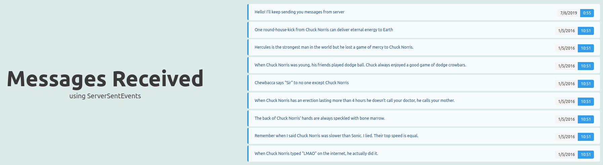
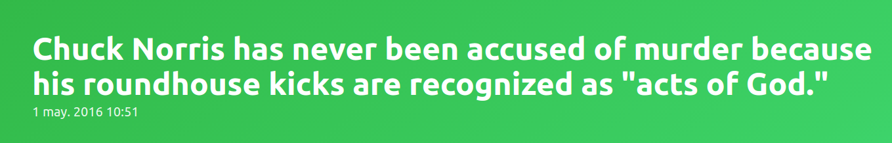

# SSE Clients
Tow different clients, almost same code. To understand the [Vue.js](https://vuejs.org) you should know a little bit about the framework (I really used this example to play with it a little bit), so for the purpouse of understanding how a SSE client works, will go through the [jquery](https://jquery.com/) one.

## Deps
**None!** As SSE _runs_ over HTTP, there's no protocol dep needed and for managing the connection you only need the `EventSource` object which included in major browser (IE and Opera Mini seems to lack it).

This code is really simple:

Just get a new `EventSource` instnace using the server URL as param (you can set some params about credentials, but we're not using those here):

```javascript
const eventSource = new EventSource('http://localhost:5001/events');
```

Populate `eventSource` instance with our functions. That's important, we are not setting listeners nor callbacks, we are setting plain functions inside our instance. It's not mandatory to set any of the functions but you need to set, at least, `onmessage`so you can do something with the info received from the server. As it sound, `onopen` is run when the `event: open` is received (check the [server](../sse-server/README.md) doc where we sent that event upon client connection) and `onerror` is run when connection gets lost:

```javascript
eventSource.onopen = function() {
  // we just set some text
  $('#title').text('Connected!');
  $('#subtitle').text(formatDate());
  // and change classes for changing background color:
  let heroElement = $('.hero');
  heroElement.removeClass('is-warning');
  heroElement.addClass('is-success');
}

eventSource.onmessage = function(message) {
  console.log(message);
  // we parse the message to json:
  let json = JSON.parse(message.data);
  // and set title and subtitle with text and date received:
  $('#title').text(json.message);
  $('#subtitle').text(formatDate(json.when));
}

eventSource.onerror = function(error) {
  // we just set some text:
  $('#title').text('Connecting...');
  $('#subtitle').text(formatDate());
  // and change classes for changing background color:
  let heroElement = $('.hero');
  heroElement.removeClass('is-success');
  heroElement.addClass('is-warning');
}
```

## Node.js Client
One problem when coding a client running on Node.js is that `EventSource` is only included in browsers. In Node.js you need to install a dep with an implementation of `EventSource`. In this exampla we have used an npm package called simple [eventsource](https://www.npmjs.com/package/eventsource) that does simply that and also includes a polyfill for broswers lacking `EventSource` too.

The [code](./node) stays the same as before, no big changes anywhere.

## Screenshots
Here is the [Vue.js](https://vuejs.org) client:



and the [jquery](https://jquery.com/) one:


